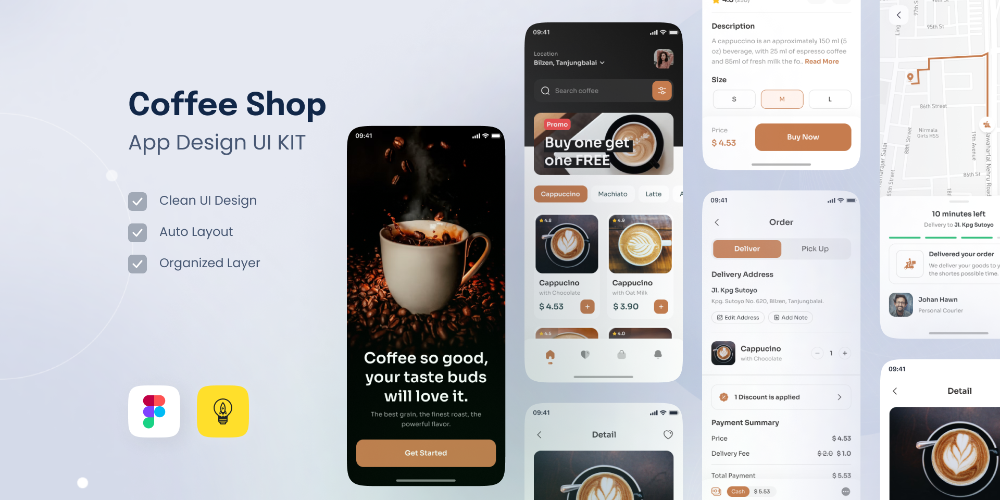
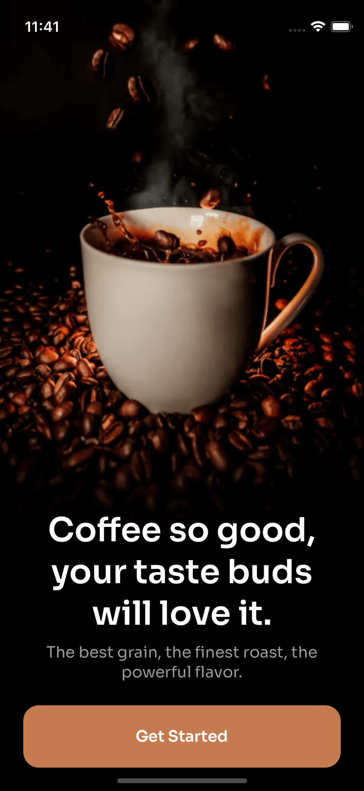
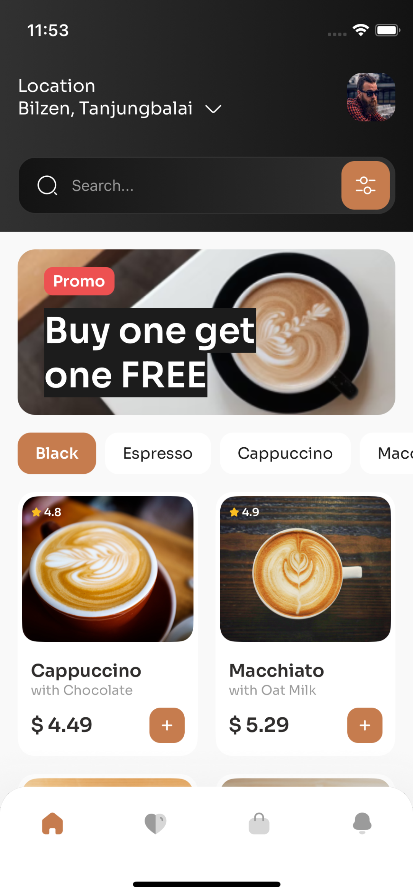
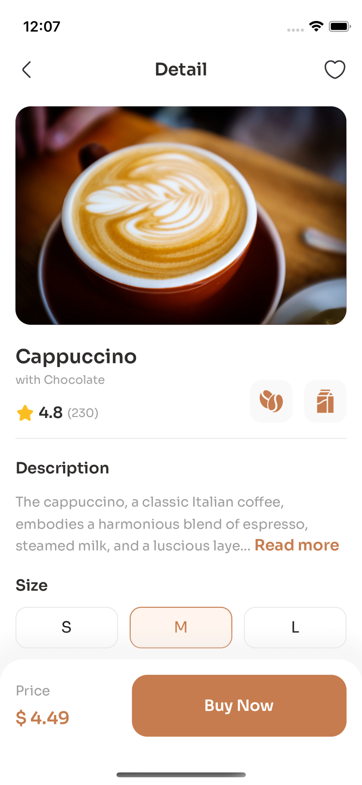
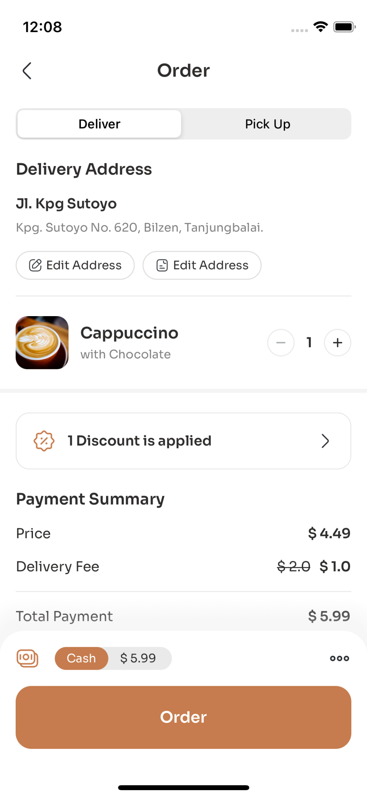
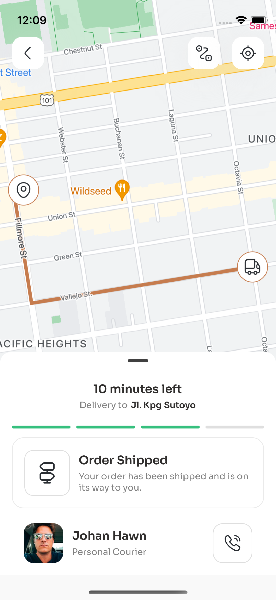

# React Native Coffee Shop

UI KIT application build with Expo.

Figma file: [Coffee Shop Mobile App Design](https://www.figma.com/community/file/1116708627748807811)

## Table of Contents

- [Video](#video)
- [Screenshots](#screenshots)
- [Features](#features)
- [Installation](#installation)

## Video

[<video src="./readme-assets/videoapp.mp4" width="200" ></video>](https://github.com/DenisDov/coffee-shop/assets/13405393/be917eb6-fa71-4d35-9702-cda7e386099a)

## Screenshots

  
  
  
  
  
 

## Features

- shopify restyle
- expo-router
- maps polyline
- Images thumbhash
- native feel touchables
- optimized assets
- google fonts
- shadowed bottom tabs
- jest unit-testing

## Installation

1. Clone the repository
2. npm i
3. npx expo start

## Build preview build locally:

android: `eas build --platform android --profile preview --local`
